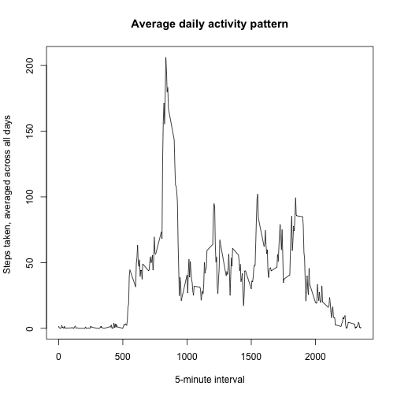

This is an R Markdown document. Markdown is a simple formatting syntax for authoring HTML, PDF, and MS Word documents. For more details on using R Markdown see <http://rmarkdown.rstudio.com>.

When you click the **Knit** button a document will be generated that includes both content as well as the output of any embedded R code chunks within the document. You can embed an R code chunk like this:

## Loading and preprocessing the data
Read Data 

```r
mydataset <- read.csv("activity.csv")
```

## What is mean total number of steps taken per day?
Get total steps ber day - using tapply 

```r
totstepsbydate <- tapply(mydataset$steps, mydataset$date, sum)
```

Plot histogram
 

remove na values and calculate Mean and madin 

```r
totstepsbydate <- totstepsbydate[!is.na(totstepsbydate)]
meanvalue <- mean(totstepsbydate)
meanvalue
```

```
## [1] 10766.19
```

```r
medianvalue <- median(totstepsbydate)
medianvalue
```

```
## [1] 10765
```
Check total and missing values

```r
nrow(mydataset) 
```

```
## [1] 17568
```

```r
sum(is.na(mydataset$steps)) 
```

```
## [1] 2304
```

```r
meanstepsday <- tapply(mydataset$steps, mydataset$date, mean)
```
Calculate mean steps / interval (Remove NA values)

```r
meansteps <- tapply(mydataset$steps, mydataset$interval, mean, na.rm = TRUE)
```

## What is the average daily activity pattern?
Plot line graph of average daily activity pattern
 
Maximum average number of steps over all days

```r
names(which.max(meansteps))
```

```
## [1] "835"
```

```r
sum(is.na(mydataset))
```

```
## [1] 2304
```
## Imputing missing values
Loop thru data and replace NA with meanstep value

```r
for (i in 1:dim(mydataset)[1]) {
 ifelse (is.na(mydataset$steps[i]) ,   mydataset$steps[i] <-  mean(meansteps) ,mydataset$steps[i] <- mydataset$steps[i])
}
```
Check na got removed

```r
nrow(mydataset) 
```

```
## [1] 17568
```

```r
sum(is.na(mydataset$steps)) 
```

```
## [1] 0
```
Re-calc using tapply as NA has been replaced and Plot Histogram 

```r
newtotalsteps <- tapply(mydataset$steps, mydataset$date, sum)
hist(newtotalsteps,  xlab = "Total Steps / Day", ylab = "Frequency", main = "Total Steps taken per day - with average meanstep")
```

 
Mean and madin 

```r
meanvalue <- mean(newtotalsteps)
meanvalue
```

```
## [1] 10766.19
```

```r
medianvalue <- median(newtotalsteps)
medianvalue
```

```
## [1] 10766.19
```
## Are there differences in activity patterns between weekdays and weekends?

```r
mydataset$date <- as.Date(mydataset$date)
getdays <- weekdays(mydataset$date)
mydataset$week_weekend <- ifelse(getdays == "Saturday" | getdays == "Sunday", "Weekend", "Weekday")
mv <- aggregate(mydataset$steps, by = list(mydataset$interval, mydataset$week_weekend), mean)                                                                          
names(mv) <- c("interval", "week_weekend", "steps")
a <- xyplot( mydataset$steps ~  mydataset$interval |  mydataset$week_weekend, mv, type = "l", layout = c(1, 2), xlab = "Interval", ylab = "Number of steps")
print(a)
```

 

##mean, median, max and min of the steps across all intervals and days by Weekdays/Weekends

```r
tapply(mv$steps, mv$week_weekend, function(x) {
  c(MINIMUM = min(x), MEAN = mean(x), MEDIAN = median(x), MAXIMUM = max(x))
})
```

```
## $Weekday
##    MINIMUM       MEAN     MEDIAN    MAXIMUM 
##   4.984347  35.610581  25.762124 207.873235 
## 
## $Weekend
##    MINIMUM       MEAN     MEDIAN    MAXIMUM 
##   4.672825  42.366401  32.704075 157.797825
```


